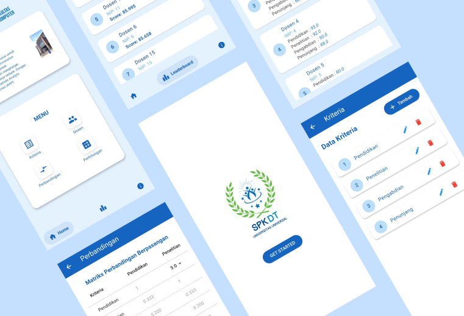

# SPKDT - Decision Support System (AHP Method)

This project was developed collaboratively as part of a team to build a Decision Support System application using Flutter for selecting the best-performing lecturer at the Faculty of Computer Science, Universitas Universal. The system applies the Analytical Hierarchy Process (AHP) method to evaluate multiple criteria and provide objective decision-making results. The application is designed to process input data, calculate weighted scores based on defined criteria, and generate ranking results in a clear and structured manner. Flutter was utilized to build a responsive and user-friendly interface, ensuring ease of use for users. This project demonstrates the ability to collaborate within a team while combining system development with analytical methods to solve real-world decision-making problems.

## 📸 App Preview

## 👤 Role
- Mobile App Developer (Team Project)

## 🛠️ Tech Stack & Tools
- Flutter
- Dart
